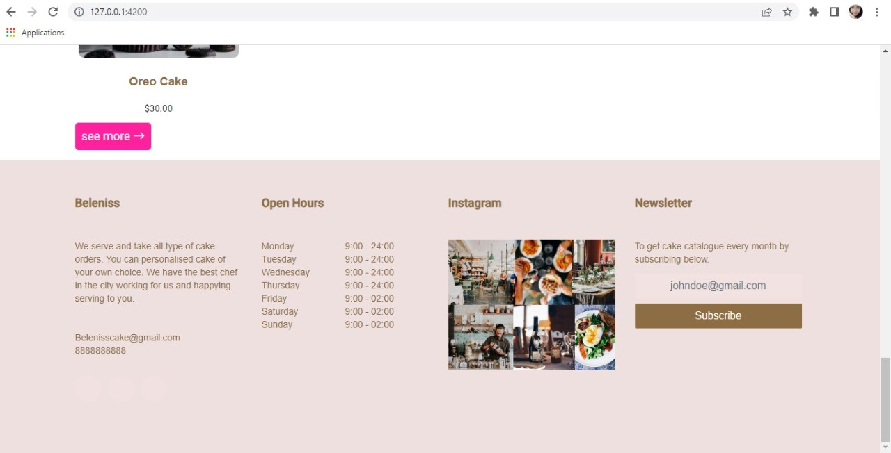
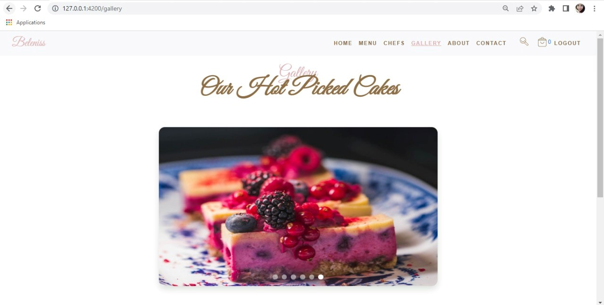

# Bakery

This project was generated with [Angular CLI](https://github.com/angular/angular-cli) version 13.3.3.

## Development server

Run `ng serve` for a dev server. Navigate to `http://localhost:4200/`. The application will automatically reload if you change any of the source files.

## Code scaffolding

Run `ng generate component component-name` to generate a new component. You can also use `ng generate directive|pipe|service|class|guard|interface|enum|module`.

## Build

Run `ng build` to build the project. The build artifacts will be stored in the `dist/` directory.

## Running unit tests

Run `ng test` to execute the unit tests via [Karma](https://karma-runner.github.io).

## Running end-to-end tests

Run `ng e2e` to execute the end-to-end tests via a platform of your choice. To use this command, you need to first add a package that implements end-to-end testing capabilities.

## Further help

To get more help on the Angular CLI use `ng help` or go check out the [Angular CLI Overview and Command Reference](https://angular.io/cli) page.

## Overview
### *Home page*

### *Gallery page*

### *About page*

### *Chefs page*

### *Menu (All products)*

### *Menu of products per category*

### *Empty Cart page*

### *Register page*

### *Login page*

## Admin
### *All products list page*

I know the dashboard design is a mess :). I still need to fix it.

### *Chefs list page*

### *Gallery list page*

### *Adding a new cake page (product)*

### *Adding a new category page*

### *Adding a new chef page*

